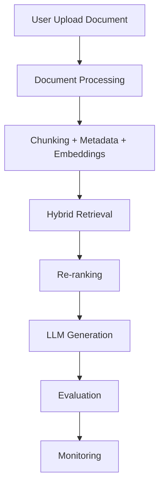
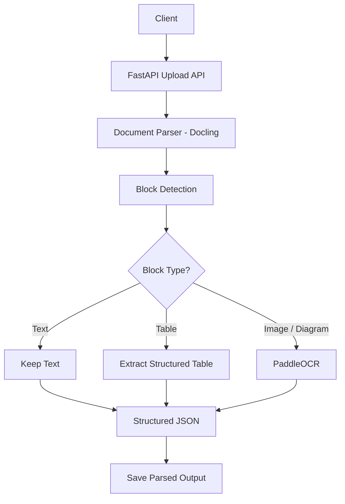
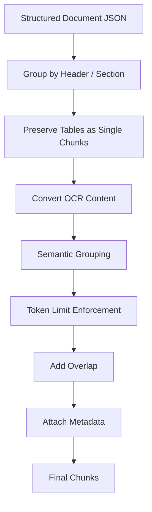
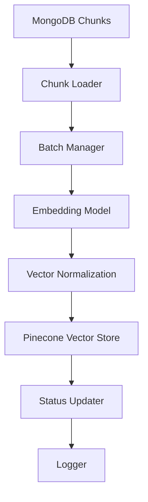
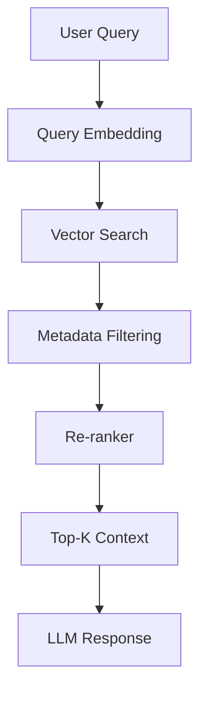
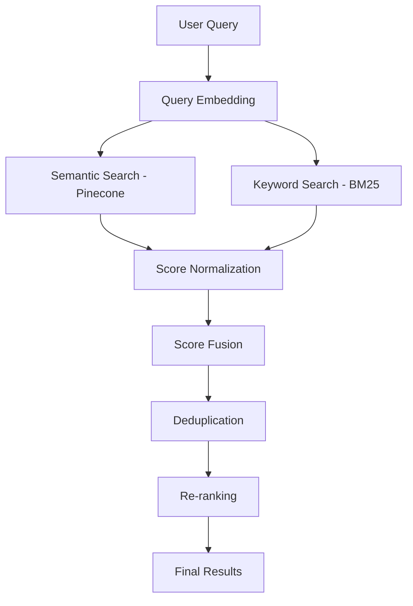
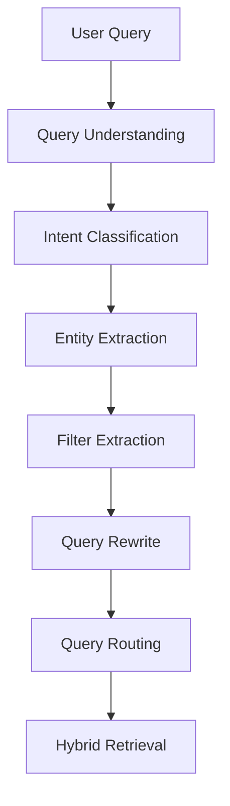
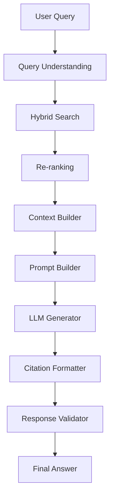
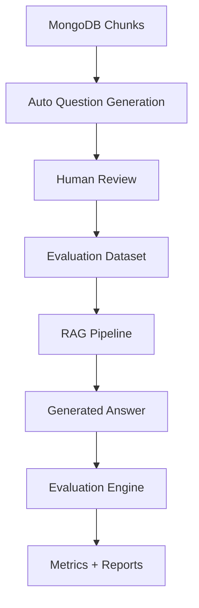
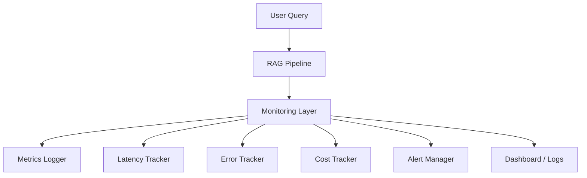

# Multimodal RAG Architecture

This project is a production-oriented multimodal RAG system that processes documents containing text, tables, images, and diagrams. It uses Docling for parsing, PaddleOCR for image-based content, smart chunking with metadata, hybrid retrieval, re-ranking, query understanding, grounded answer generation, evaluation, and monitoring.

**Full Lifecycle:**
 
```
Upload → Parse → OCR → Chunk → Embed → Retrieve → Re-rank → Generate → Evaluate → Monitor
```

## 🛠️ Tech Stack
 
| Component | Technology |
|-----------|------------|
| **API Framework** | FastAPI |
| **Document Parsing** | Docling |
| **OCR** | PaddleOCR |
| **Embedding Model** | BAAI/bge-large-en-v1.5 |
| **Vector Store** | Pinecone |
| **Keyword Search** | BM25 |
| **Database** | MongoDB |
| **LLM** | OpenAI / Any LLM |
| **Evaluation** | Custom + RAGAS |
| **Monitoring** | Custom Logger + Dashboards + Langsmith|
 
---

## 1. High-Level System Overview



# 2. Phase-by-Phase Architecture
## Phase 1 — Document Ingestion & Parsing
### Goal

Build a production ingestion service that accepts **PDF, DOCX, and image files**, parses them, detects document structure, runs OCR when needed, and stores structured output.

### What this phase does

* Accepts uploaded files
* Parses documents using **Docling**
* Detects:

  * text
  * tables
  * images
  * diagrams / charts
* Sends image-based content to **PaddleOCR**
* Produces structured **JSON / Markdown**
* Saves processed output for downstream pipeline stages

### Flow diagram



### Output

Structured document representation in JSON/Markdown.

### Why it matters

This phase creates the foundation for the entire RAG system. If parsing is weak, retrieval quality will suffer later.

## Phase 2 — Chunking & Metadata Layer

### Goal

Break structured documents into retrieval-friendly chunks while preserving context and structure.

### What this phase does

* Groups content by section/header
* Preserves tables as single chunks
* Converts OCR text into chunkable form
* Applies semantic grouping
* Enforces token limits
* Adds overlap
* Attaches metadata like:

  * document id
  * page number
  * section name
  * chunk type
  * source file

### Flow diagram



### Output

Clean, structured chunks with metadata.

### Why it matters

Chunking directly affects retrieval precision, latency, and answer quality.


## Phase 3 — Embedding Pipeline

### Goal

Convert chunks into vector embeddings and store them in the vector database.

### What this phase does

* Loads chunks from MongoDB
* Processes chunks in batches
* Generates embeddings using **BAAI/bge-large-en-v1.5**
* Normalizes vectors
* Stores vectors in **Pinecone**
* Updates embedding status
* Logs pipeline activity

### Flow diagram



### Output

Embedded chunks stored in Pinecone and ready for retrieval.

### Why it matters

Embeddings are what make semantic search possible in your RAG system.

## Phase 4 — Retrieval & Re-ranking

### Goal

Retrieve the most relevant chunks for a user query and rank them properly before generation.

https://github.com/ALucek/rag-reranking/blob/main/reranking.ipynb
### What this phase does

* Embeds the user query
* Searches the vector database
* Applies metadata filtering
* Sends top candidates to reranker
* Returns the best chunks as context

### Flow diagram



### Output

High-quality retrieved context for answer generation.

### Why it matters

This phase ensures the model sees the most relevant information before generating an answer.

## Phase 5 — Hybrid Search (Semantic + BM25)

### Goal

Combine semantic search and keyword search for stronger retrieval.

### What this phase does

* Runs semantic search using Pinecone
* Runs keyword search using BM25
* Normalizes scores
* Merges results
* Deduplicates candidates
* Sends final result set to reranker

### Flow diagram



### Output

A stronger, more balanced set of retrieval candidates.

### Why it matters

Hybrid search improves recall and handles both meaning-based and exact-match queries.

## Phase 6 — Query Understanding

### Goal

Understand the user’s intent before retrieval so the system can route the query intelligently.

### What this phase does

* Classifies query intent
* Extracts entities
* Identifies filters
* Rewrites ambiguous queries
* Chooses the right retrieval strategy

### Flow diagram



### Output

Structured query representation with intent and filters.

### Why it matters

This reduces ambiguity and improves accuracy, speed, and retrieval relevance.

## Phase 7 — Answer Generation

### Goal

Generate grounded answers from retrieved context while reducing hallucination.

### What this phase does

* Builds context from top retrieved chunks
* Creates a prompt
* Sends prompt to LLM
* Formats answer with citations
* Validates output
* Logs response metadata

### Flow diagram



### Output

A grounded, citation-backed answer.

### Why it matters

This is the stage where the system becomes a true RAG application.

## Phase 8 — Evaluation

### Goal

Measure whether the system is producing correct, grounded, and useful answers consistently.

### What this phase does

* Builds evaluation dataset
* Generates test questions from chunks
* Uses human review for validation
* Evaluates retrieval quality
* Evaluates answer quality
* Measures grounding, latency, and cost

### Flow diagram



### Output

Evaluation dataset plus performance metrics and reports.

### Why it matters

Evaluation tells you whether the system works reliably, not just once.

## Phase 9 — Monitoring

### Goal

Monitor system health, performance, errors, latency, and cost in production.

### What this phase does

* Logs every query
* Tracks latency
* Tracks token usage
* Tracks errors
* Measures retrieval and generation performance
* Detects failures and anomalies
* Supports dashboards and alerts

### Flow diagram



### Output

Full observability for the RAG system.

### Why it matters

Monitoring makes the system production-ready and helps catch issues early.

## 📂 Repository Structure

```text
├── .env
├── .env_example
├── .gitignore
├── README.md
├── app
│   ├── api
│   │   ├── documents.py
│   │   ├── embeddings.py
│   │   ├── monitoring_router.py
│   │   ├── query.py
│   │   └── upload.py
│   ├── config
│   │   └── settings.py
│   ├── database
│   │   ├── chunk_repository.py
│   │   ├── document_repository.py
│   │   ├── log_repository.py
│   │   ├── mongodb_client.py
│   │   ├── pinecone_client.py
│   │   └── response_repository.py
│   ├── generation
│   │   ├── __init__.py
│   │   ├── answer_service.py
│   │   ├── citation_builder.py
│   │   ├── context_builder.py
│   │   ├── llm_generator.py
│   │   ├── prompt_builder.py
│   │   └── response_validator.py
│   ├── main.py
│   ├── models
│   │   └── schemas.py
│   ├── services
│   │   ├── chunking
│   │   │   ├── chunker.py
│   │   │   ├── metadata_builder.py
│   │   │   └── tokenizer.py
│   │   ├── docling_parser.py
│   │   ├── embedding
│   │   │   ├── __init__.py
│   │   │   ├── batch_manager.py
│   │   │   ├── embedding_model.py
│   │   │   ├── embedding_pipeline.py
│   │   │   ├── embedding_service.py
│   │   │   ├── retry_handler.py
│   │   │   └── vector_builder.py
│   │   ├── file_service.py
│   │   ├── ocr_service.py
│   │   ├── pipeline
│   │   │   ├── __init__.py
│   │   │   └── embedding_pipeline.py
│   │   ├── query_understanding
│   │   │   ├── __init__.py
│   │   │   ├── filter_extractor.py
│   │   │   ├── query_classifier.py
│   │   │   ├── query_rewriter.py
│   │   │   ├── query_router.py
│   │   │   ├── query_types.py
│   │   │   └── query_understanding.py
│   │   ├── retrieval
│   │   │   ├── __init__.py
│   │   │   ├── bm25_search.py
│   │   │   ├── metadata_filter.py
│   │   │   ├── query_embedder.py
│   │   │   ├── reranker.py
│   │   │   ├── retrieval_pipeline.py
│   │   │   └── vector_search.py
│   │   └── vector_store
│   │       ├── __init__.py
│   │       └── pinecone_client.py
│   └── utils
│       ├── logger.py
│       └── score_normalizer.py
├── evaluation
│   ├── __init__.py
│   ├── config.py
│   ├── eval_config.py
│   ├── generate_eval_dataset.py
│   ├── llm_generator.py
│   ├── logger.py
│   ├── mongo_loader.py
│   ├── run_eval.py
│   ├── scorer.py
│   └── validator.py
├── frontend
│   └── app.py
├── monitoring
│   ├── __init__.py
│   ├── alert_manager.py
│   ├── cost_tracker.py
│   ├── error_tracker.py
│   ├── health_checker.py
│   ├── latency_tracker.py
│   ├── metrics_logger.py
│   └── monitoring_config.py
├── requirements.txt
├── run.py
```

## 🚀 How to Run
 
```bash
# 1. Clone the repository
https://github.com/mistrytejasm/Advance-RAG.git
 
# 2. Install dependencies
pip install -r requirements.txt
 
# 3. Set up environment variables
cp .env.example .env
# Fill in your API keys: Pinecone, OpenAI, MongoDB, etc.
 
# 4. Start the API server
uvicorn app.main:app --reload
 
# 5. Upload a document
curl -X POST http://localhost:8000/upload -F "file=@your_document.pdf"
```
 
---
 
## 📈 Evaluation
 
Run the evaluation suite against your deployed pipeline:
 
```bash
python evaluation/evaluator.py --dataset data/eval_dataset.json --report outputs/report.json
```
 
Metrics tracked:
- **Retrieval:** Precision@K, Recall@K, MRR
- **Generation:** Faithfulness, Answer Relevancy, Hallucination Rate
- **System:** Latency (P50/P95/P99), Token Cost
---
  
<p align="center">Built with ❤️ by TejasH MistrY </p> 
