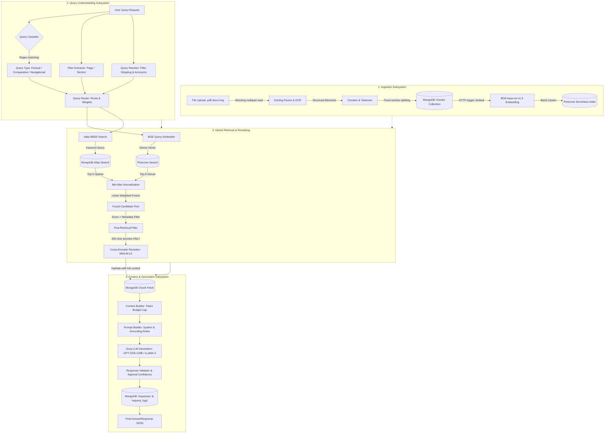

# Comprehensive Engineering Audit & Production-Readiness Report: Advanced RAG Pipeline

**System Under Audit:** Advanced RAG Pipeline (FastAPI, Docling, PaddleOCR, BGE Embeddings, Pinecone, MongoDB Atlas BM25, Cross-Encoder Reranker, Groq LLM)  
**Audit Scope:** End-to-End Ingestion, Query Understanding, Dense & Sparse Retrieval, Hybrid Fusion, Cross-Encoder Reranking, Context Packaging, Generation, Grounding & Citations, Performance, Cost, Observability, Multi-Tenancy, and Security.

---

## 1. Executive Summary

This engineering audit examines the complete architecture, implementation logic, database design, and operational characteristics of the Advanced RAG codebase. While the pipeline incorporates modern architectural patterns (such as structure-aware parsing, hybrid dense-sparse search, cross-encoder reranking, and dynamic query routing), our deep inspection identified **22 critical, high, medium, and low issues** across data ingestion, query processing, retrieval fusion, prompt construction, error resilience, concurrency, and security.

### Core Architecture Flow & Vulnerability Overview

```
[ Ingestion Flow ]
Raw PDF/Doc/Image ─► FastAPI /upload (Sync/Blocking) ─► Docling (Subprocess Split) + PaddleOCR
                              │
                              ▼
                   Token-Based Buffer Chunker (Fixed cl100k_base for non-OpenAI models)
                              │
                              ▼
                        MongoDB (chunks) ───► POST /embed (Synchronous HTTP) ──► BGE / Pinecone

[ Query & Generation Flow ]
User Query ─► /answer ─► Regex Rule Classifier & Hardcoded Rewriter (Brittle, English/AI-only)
                               │
               ┌───────────────┴───────────────┐
               ▼                               ▼
    BGE Dense Embed (CPU/GPU)       MongoDB Atlas BM25 ($search without pre-filter)
    Pinecone Query (k=20)           Atlas Aggregation (k=20)
               │                               │
               └───────────────┬───────────────┘
                               ▼
            Min-Max Normalization (Per-Query Relative Distortion)
                               │
                               ▼
        Post-Retrieval In-Memory Filtering (Loss of Top-K candidates)
                               │
                               ▼
          Cross-Encoder Reranking (Truncated 200-char Previews only)
                               │
                               ▼
               Context Builder (Greedy Top-Down Selection)
                               │
                               ▼
               Groq Chat Completion (Blocking I/O in Async Loop)
                               │
                               ▼
    Heuristic Response Validator & Synthetic Sigmoid Confidence Calculation
```

---

## 2. System Architecture Diagrams

### 2.1 Workflow & State Diagram (Mermaid)



---

### 2.2 Target Microservices & Data Pipeline Architecture (ASCII)

```
+==================================================================================================+
|                                    CLIENTS & API GATEWAY                                         |
|    - Rate Limiting (Redis Token Bucket)          - Mutual TLS & JWT Multi-Tenant Auth             |
|    - Request Correlation ID (X-Request-ID)       - OpenTelemetry Distributed Tracing             |
+==================================================================================================+
                                            │
               ┌────────────────────────────┴────────────────────────────┐
               ▼                                                         ▼
+-----------------------------+                           +----------------------------------------+
|   DOCUMENT INGESTION API    |                           |      QUERY & ORCHESTRATION ENGINE      |
|  - Async File Ingestion     |                           |  - Fast Intent Embeddings / LLM Router |
|  - Chunking & Metadata      |                           |  - Semantic Cache (Redis / Qdrant)     |
|  - Task Queue (Celery/Arq)  |                           |  - Concurrent Async Retrieval Engine   |
+-----------------------------+                           +----------------------------------------+
               │                                                         │
       ┌───────┴───────┐                                         ┌───────┴───────┐
       ▼               ▼                                         ▼               ▼
+-------------+ +-------------+                           +-------------+ +------------------------+
|   PARSER    | | EMBEDDING   |                           | DENSE INDEX | | SPARSE INDEX           |
|   WORKER    | | WORKER      |                           | (Pinecone / | | (MongoDB Atlas Search  |
|  (Docling / | | (BGE Batch  |                           |  Milvus /   | |  with pre-filtering    |
|   Paddle)   | |  Worker)    |                           |  Qdrant)    | |  $search compound)     |
+-------------+ +-------------+                           +-------------+ +------------------------+
       │               │                                         │               │
       └───────┬───────┘                                         └───────┬───────┘
               ▼                                                         ▼
+-----------------------------+                           +----------------------------------------+
| PRIMARY METADATA & STORAGE  |                           |       RECIPROCAL RANK FUSION (RRF)     |
|  - MongoDB Document Store   |                           |  - Rank-based scale-invariant fusion   |
|  - S3 / Blob Raw Storage    |                           |  - Full-text Cross-Encoder Rerank      |
+-----------------------------+                           +----------------------------------------+
                                                                         │
                                                                         ▼
                                                          +----------------------------------------+
                                                          |  CONTEXT ASSEMBLY & LLM GENERATION     |
                                                          |  - Lost-in-the-Middle Reordering       |
                                                          |  - Async Groq / vLLM Streaming         |
                                                          |  - Hallucination / Self-Reflect Check  |
                                                          +----------------------------------------+
```

---

## 3. Comprehensive Engineering Issues Audit

---

### [ISSUE-01] [CRITICAL] Cross-Encoder Reranking Evaluates Truncated 200-Character Previews Instead of Full Chunk Text

#### 1. Issue Description
In `app/services/retrieval/reranker.py` (lines 75–78), the cross-encoder constructs candidate pairs using only the `content_preview` field stored in Pinecone metadata:
```python
pairs = [
    (query, c.get("metadata", {}).get("content_preview", ""))
    for c in candidates
]
```
In `app/services/embedding/vector_builder.py` (line 44), `content_preview` is hard-truncated to the first 200 characters:
```python
"content_preview": chunk.get("content", "")[:200]
```
The full chunk content is only hydrated from MongoDB in Step 7 **after** the reranker has already selected and discarded candidates.

#### 2. Why It Is a Problem
Cross-encoders compute fine-grained token-level cross-attention across the query and document. If the answer to the user's question is located at character 250 of a 700-character chunk, the cross-encoder evaluates only the first 200 characters (often just header text or introductory boilerplate). The cross-encoder gives the chunk a low logit score and discards the most relevant passage.

#### 3. Impact on Current Pipeline
- **Accuracy & Retrieval Quality:** Severe degradation in Precision@K and Recall@K after reranking. Relevant chunks are filtered out before reaching the LLM.
- **Hallucination Rate:** High. When relevant evidence is discarded, the LLM either refuses to answer or attempts to extrapolate from partial fragments.

#### 4. Simple Example
- **Chunk text:** *"Section: Loss Functions. For classification tasks involving multiple discrete categories, cross-entropy loss is standard. In contrast, for regression tasks predicting continuous price variables, Root Mean Squared Error (RMSE) must be used."* (219 chars).
- **Preview (first 200 chars):** *"Section: Loss Functions. For classification tasks involving multiple discrete categories, cross-entropy loss is standard. In contrast, for regression tasks predicting continuous price variables, Root "*
- **Query:** *"What loss function is used for continuous price variables?"*
- **Expected Behavior:** Cross-encoder reads *"Root Mean Squared Error (RMSE)"*, assigns high score (+7.8), and places chunk in Top 1.
- **Current Pipeline Behavior:** Cross-encoder only sees text cutting off at *"Root"*, scores chunk poorly (-2.4), and drops it.

#### 5. Root Cause
Architectural ordering defect: MongoDB hydration was placed after reranking to minimize database reads, but Pinecone metadata was not designed to carry full context.

#### 6. Production-Grade Fix
Hydrate full chunk texts from MongoDB **before** invoking the cross-encoder, or store full chunk texts in the vector payload if vector store memory allows. Batch-fetch all candidate IDs in a single `$in` query prior to reranking.

```python
# Revised Flow in retrieval_pipeline.py
candidate_ids = [c["chunk_id"] for c in filtered]
mongo_chunks = _fetch_mongo_content(chunk_repo, document_id, candidate_ids)

# Inject full content into candidates before reranking
for c in filtered:
    c["content"] = mongo_chunks.get(c["chunk_id"], c.get("metadata", {}).get("content_preview", ""))

# Pass full content into Reranker
reranked = reranker.rerank(query=qu.original_query, candidates=filtered, top_k=rerank_top_k)
```

---

### [ISSUE-02] [CRITICAL] Min-Max Normalization Causes Severe Rank Distortion in Outlier and Sparse Candidate Scenarios

#### 1. Issue Description
In `app/utils/score_normalizer.py` (lines 48–55), linear Min-Max normalization is applied independently to vector cosine scores and BM25 scores:
```python
scores = [r[score_key] for r in results]
min_score = min(scores)
max_score = max(scores)
score_range = max_score - min_score
for r in results:
    r[out_key] = (r[score_key] - min_score) / score_range
```

#### 2. Why It Is a Problem
Min-Max normalization is relative only to the retrieved batch, not absolute:
1. **The Single Strong Hit Distortion:** If BM25 returns one exact hit with score 24.0 and 19 weak hits with scores around 1.0, the weak hit with score 1.1 receives normalized score $(1.1 - 1.0) / 23.0 = 0.004$.
2. **Dense Vector Floor Distortion:** If vector scores range narrowly between $0.88$ (rank 1) and $0.82$ (rank 20), $0.82$ becomes $0.0$. A chunk with high semantic similarity ($0.82$) is penalized as if it had zero relevance.
3. **Threshold Breakdown:** In Step 5 of `retrieval_pipeline.py`, a fixed threshold `min_score = 0.6` is applied to the fused score. A completely irrelevant query where all cosine scores are $0.10 - 0.12$ will normalize $0.12$ to $1.0$, bypassing the threshold filter.

#### 3. Impact on Current Pipeline
- Inconsistent retrieval across varying query lengths and corpus distributions.
- Irrelevant chunks pass similarity thresholds when candidate score spreads are narrow.
- Highly relevant semantic matches get discarded when combined with high-variance BM25 matches.

#### 4. Simple Example
- Query: *"Transformer Multi-Head Attention"*
- Vector candidate $A$: Cosine similarity $0.85$ (Min in batch = $0.84$, Max = $0.86$). Normalized score = $(0.85-0.84)/(0.02) = 0.50$.
- BM25 candidate $B$: Score $2.0$ (Min in batch = $0.0$, Max = $2.0$). Normalized score = $(2.0-0.0)/2.0 = 1.00$.
- Fused score for $A$ ($0.7 \times 0.5 + 0.3 \times 0.0 = 0.35$) fails the $0.60$ threshold and is deleted, even though its true cosine similarity was $0.85$.

#### 5. Root Cause
Algorithmic flaw: Using bounded local Min-Max scaling for unbounded and differently distributed score distributions without considering absolute relevance bounds.

#### 6. Production-Grade Fix
Adopt **Reciprocal Rank Fusion (RRF)**, which is scale-invariant, robust against score distribution differences, and standard in production hybrid search engines:

$$\text{RRF\_Score}(d) = \sum_{m \in M} \frac{w_m}{k + \text{rank}_m(d)}$$

Where $k \approx 60$, $w_m$ is the modality weight, and $\text{rank}_m(d)$ is the 1-based rank in retrieval modality $m$.

```python
def reciprocal_rank_fusion(
    vector_results: list[dict],
    bm25_results: list[dict],
    vector_weight: float = 0.7,
    bm25_weight: float = 0.3,
    k: int = 60
) -> list[dict]:
    fused_scores = {}
    docs = {}

    for rank, doc in enumerate(vector_results, start=1):
        cid = doc["chunk_id"]
        fused_scores[cid] = fused_scores.get(cid, 0.0) + vector_weight * (1.0 / (k + rank))
        docs[cid] = doc

    for rank, doc in enumerate(bm25_results, start=1):
        cid = doc["chunk_id"]
        fused_scores[cid] = fused_scores.get(cid, 0.0) + bm25_weight * (1.0 / (k + rank))
        if cid not in docs:
            docs[cid] = doc

    for cid, score in fused_scores.items():
        docs[cid]["hybrid_score"] = round(score, 6)

    return sorted(docs.values(), key=lambda x: x["hybrid_score"], reverse=True)
```

---

### [ISSUE-03] [CRITICAL] Post-Query Metadata Filtering Causes Candidate Starvation & Empty Retrieval Contexts

#### 1. Issue Description
In `app/services/retrieval/retrieval_pipeline.py` (lines 88–98 and 164–170), vector search and BM25 retrieve top $K$ candidates ($K=20$) across the whole collection **without** metadata filters. The extracted filters (`page`, `section`, `content_type`) are applied in Python **after** retrieval via `MetadataFilter.filter()`.

#### 2. Why It Is a Problem
When a user asks: *"Show the performance table on page 34"*:
1. Dense vector search retrieves the 20 most semantically similar chunks across the 500-page document (e.g., matching the concept "performance table").
2. Chunks from page 34 rank at positions 25, 41, and 88 in the global similarity list.
3. The top 20 candidates returned from Pinecone contain zero chunks from page 34.
4. Python `MetadataFilter` evaluates `if r["page"] == 34`, discards all 20 candidates, and returns an empty list.

#### 3. Impact on Current Pipeline
- **Candidate Starvation:** High failure rate on filtered queries (`SearchRoute.HYBRID_FILTERED`).
- **Unnecessary LLM Refusals:** The system reports "no relevant information found" even when the document contains the exact page requested.

#### 4. Simple Example
- Document: 100 pages. Total chunks: 400.
- User Query: *"Summarize the conclusion in section Introduction"*
- Global vector search finds 20 chunks with the word "conclusion" scattered across pages 80–100.
- Post-filter removes all 20 because `section != "Introduction"`. Result count = 0.

#### 5. Root Cause
Architectural flaw: Performing post-retrieval filtering instead of engine-native pre-filtering at the database query layer.

#### 6. Production-Grade Fix
Push metadata filters directly into the Pinecone query and MongoDB `$search` compound operator:

```python
# In vector_search.py:
pinecone_filter = {}
if "content_type" in filters:
    pinecone_filter["content_type"] = {"$eq": filters["content_type"]}
if "page" in filters:
    pinecone_filter["page"] = {"$eq": filters["page"]}

response = pinecone_store.query_vectors(
    vector=query_vector,
    top_k=top_k,
    namespace=namespace,
    filter=pinecone_filter or None,
    include_metadata=True
)

# In bm25_search.py:
search_compound = {
    "must": [{"text": {"query": query, "path": ["content", "section"]}}]
}
if "content_type" in filters:
    search_compound.setdefault("filter", []).append(
        {"text": {"query": filters["content_type"], "path": "content_type"}}
    )
pipeline = [{"$search": {"index": HYBRID_INDEX_NAME, "compound": search_compound}}]
```

---

### [ISSUE-04] [CRITICAL] Synchronous, Blocking Document Ingestion and Subprocess Execution in FastAPI Event Loop

#### 1. Issue Description
In `app/api/upload.py` (lines 16–64), `/upload` is defined as `async def`, but executes heavy CPU-bound and disk-bound synchronous operations directly on the main thread:
- `file.file.read()` (synchronous blocking I/O)
- `parse_document()` (spawns PyPDF and Docling CPU workers, writes temporary PDF files)
- `extract_text_from_image()` (invokes PaddleOCR deep learning inference)
- `chunker.chunk_document_elements()`
- Multiple single-document MongoDB inserts in a synchronous loop (`for chunk in semantic_chunks: chunk_repo.insert_chunk(chunk)`).

#### 2. Why It Is a Problem
FastAPI executes `async def` route handlers directly in the main asyncio event loop thread. When `parse_document()` or `PaddleOCR` executes for 30–90 seconds on a PDF, **the entire asyncio event loop is blocked**. During this window, the API cannot accept new incoming requests, respond to `/health`, or serve `/query` and `/answer` endpoints for other users.

#### 3. Impact on Current Pipeline
- **Throughput Collapse:** Single-user ingestion freezes all concurrent search and query traffic.
- **Health Check Failures:** Kubernetes/container liveness probes will timeout and trigger container restarts during PDF ingestion.
- **Worker Starvation:** Inability to scale horizontally without dedicated background workers.

#### 4. Simple Example
- User A uploads a 30-page PDF at 10:00:00 AM (processing takes 45s).
- User B submits a query at 10:00:05 AM.
- Expected behavior: User B receives an answer within 1.5s.
- Actual behavior: User B's connection hangs until 10:00:46 AM or times out with HTTP 504.

#### 5. Root Cause
Improper concurrency design: Running blocking CPU-bound pipelines inside the asynchronous web server thread without a background task runner or thread pool offloading.

#### 6. Production-Grade Fix
1. Decouple upload from processing: Upload endpoint saves the file and enqueues a background task (using Celery, Redis Streams, or FastAPI `BackgroundTasks` via `run_in_threadpool`).
2. Return HTTP 202 Accepted with a `job_id` and expose a polling/webhook status endpoint.

```python
from fastapi import APIRouter, UploadFile, File, BackgroundTasks, status
from fastapi.concurrency import run_in_threadpool

@router.post("/upload", status_code=status.HTTP_202_ACCEPTED)
async def upload_document(
    background_tasks: BackgroundTasks,
    file: UploadFile = File(...)
):
    file_info = await run_in_threadpool(save_file, file)
    document_id = file_info["file_id"]
    
    # Offload heavy pipeline to background worker
    background_tasks.add_task(
        process_document_background,
        document_id=document_id,
        file_path=file_info["file_path"],
        filename=file.filename
    )
    
    return {
        "status": "queued",
        "document_id": document_id,
        "check_status_url": f"/documents/{document_id}/status"
    }
```

---

### [ISSUE-05] [HIGH] Model Tokenizer Mismatch in Chunking & Token Budgeting

#### 1. Issue Description
In `app/services/chunking/tokenizer.py` (lines 4–7) and `app/generation/context_builder.py` (line 29), the system uses OpenAI's `cl100k_base` (tiktoken) tokenizer for chunking and context window management:
```python
_ENCODER = tiktoken.get_encoding("cl100k_base")
```
However, the embedding model is `BAAI/bge-base-en-v1.5` (which uses the BERT WordPiece tokenizer with a 512-token max limit), and the generation model is `openai/gpt-oss-120b` or `llama-3.3-70b-versatile` (which uses SentencePiece / LLaMA BPE).

#### 2. Why It Is a Problem
1. **Embedding Truncation:** `CHUNK_SIZE = 180` cl100k tokens can translate to >260 WordPiece tokens on technical vocabulary, code, or math symbols. If headers or prepended section metadata push this past 512 WordPiece tokens, BGE silently truncates the end of the text.
2. **Context Budget Errors:** Tiktoken token counts deviate by $\pm 20\%$ from LLaMA/Mistral tokenizers. Context limits may be exceeded or unnecessarily starved.

#### 3. Impact on Current Pipeline
- Semantic information loss at the tail of chunks during embedding.
- Unpredictable token usage and occasional prompt truncation errors from LLM providers.

#### 4. Simple Example
- Text with technical mathematical notation or code snippets: `y = \sigma(W^T x + b)`
- Tiktoken counts: 8 tokens.
- Hugging Face BERT Tokenizer: 22 subword tokens.

#### 5. Root Cause
Code-level shortcut: Using `tiktoken` globally rather than the specific tokenizers tied to the underlying Hugging Face and open-weights models.

#### 6. Production-Grade Fix
Instantiate the actual Hugging Face tokenizer corresponding to `EMBEDDING_MODEL_NAME` for the chunker, and load the proper tokenizer (e.g., Hugging Face `AutoTokenizer.from_pretrained("meta-llama/Llama-3-70b")`) for context construction.

---

### [ISSUE-06] [HIGH] Brittle Regex-Only Query Understanding and Acronym Injection Hazards

#### 1. Issue Description
In `app/services/query_understanding/query_classifier.py` and `query_rewriter.py`, query intent and rewriting rely entirely on hardcoded regex lists and a static 26-item AI acronym map.
Furthermore, in `query_rewriter.py` (lines 56–83), acronyms are expanded by appending all constituent words directly:
```python
"bert": "BERT Bidirectional Encoder Representations Transformers"
```
And in `filter_extractor.py` (line 44), section extraction captures any text between trigger phrases:
```python
r"(?:in|from|about|on|covering)\s+the\s+(.+?)\s+section\b"
```

#### 2. Why It Is a Problem
1. **Domain Inflexibility:** Queries with natural variations, typos, non-AI terminology, or multi-clause questions misclassify to `UNKNOWN`.
2. **Greedy Regex Over-Capture:** In *"Tell me about the introduction to neural networks section"*, the regex extracts `introduction to neural networks` as the section title. If the document heading was simply *"Introduction"*, the exact/substring match fails and eliminates all valid chunks.
3. **Lexical Drift:** Expanding single-token queries into long strings alters BM25 term saturation and degrades TF-IDF scoring.

#### 3. Impact on Current Pipeline
- Query classification fails on non-standard phrasing.
- Metadata filters fail silently due to over-specific regex extraction.
- Inability to support non-AI enterprise documents without manually rewriting code.

#### 4. Simple Example
- Query: *"What was discussed regarding the budget in the financial overview section?"*
- Regex extracts `financial overview` as `section`.
- Actual PDF section title: *"Financial Overview & Projections 2026"*.
- `MetadataFilter` executes `"financial overview" in "financial overview & projections 2026".lower()` -> succeeds here, but if the section was *"2026 Financials"*, it fails completely.

#### 5. Root Cause
Design limitation: Attempting to replace semantic Natural Language Understanding (NLU) with hardcoded regex patterns.

#### 6. Production-Grade Fix
Use a fast, low-latency Small Language Model (SLM) such as `llama-3.2-3b-instruct` or structured JSON output with function calling for semantic query understanding, with a regex fallback:

```python
class QueryAnalysis(BaseModel):
    intent: Literal["factual", "comparative", "procedural", "navigational"]
    rewritten_query: str
    target_page: Optional[int] = None
    target_section: Optional[str] = None
    content_type: Optional[Literal["text", "table", "image"]] = None
```

---

### [ISSUE-07] [HIGH] Synthetic Sigmoid Confidence Metric Misrepresents LLM Answer Reliability

#### 1. Issue Description
In `app/generation/answer_service.py` (lines 264–285), the answer confidence is computed via a fixed sigmoid function over the average cross-encoder rerank score of the retrieved chunks:
```python
avg = mean(c.get("rerank_score", 0.0) for c in chunks)
sigmoid = 1.0 / (1.0 + math.exp(-avg / scale))
```

#### 2. Why It Is a Problem
1. **Uncalibrated Model Scores:** Cross-encoder raw output logits are uncalibrated and depend heavily on passage length and query structure.
2. **Retrieval Score != Generation Quality:** A high retrieval score ($0.95$) only indicates that the chunks matched the query. It does **not** indicate whether:
   - The LLM hallucinated,
   - The LLM ignored the context,
   - The retrieved chunks contained contradictory facts.
3. **False Confidence to API Consumers:** Downstream enterprise consumers relying on `confidence > 0.85` for automated action will execute hallucinated answers that had high retrieval scores.

#### 3. Impact on Current Pipeline
- Inaccurate confidence reporting.
- Downstream systems cannot reliably use the confidence score to detect hallucinations.

#### 4. Simple Example
- Query: *"What was the net profit in 2025?"*
- Chunks: Excellent 10-K financial filings retrieved (Rerank score: $+8.5 \rightarrow \text{Confidence} = 0.94$).
- Context statement: *"Net profit was not reported for 2025 due to pending audit."*
- LLM Output: *"The net profit in 2025 was $4.2 billion."* (Pure hallucination).
- System returned metadata: `confidence: 0.94`, `is_grounded: true`.

#### 5. Root Cause
Conceptual flaw: Conflating retrieval similarity logits with answer grounding and factual faithfulness.

#### 6. Production-Grade Fix
Implement actual generation verification using token log-probabilities or a dual-pass evaluation metric (e.g., Ragas Faithfulness or an inline NLI entailment checker):

```python
def verify_faithfulness(answer: str, context: str) -> float:
    # Use cross-encoder trained for NLI (e.g., cross-encoder/nli-deberta-v3-small)
    # Premise: Context, Hypothesis: Answer sentences
    # Returns empirical entailment probability [0.0 - 1.0]
    ...
```

---

### [ISSUE-08] [HIGH] Monolithic MongoDB Atlas BM25 Post-Search Filtering Inefficiency

#### 1. Issue Description
In `app/services/retrieval/bm25_search.py` (lines 65–70), document-level namespace isolation is performed by appending `$match` **after** the `$search` stage:
```python
pipeline = [search_stage]
if document_id:
    pipeline.append({"$match": {"document_id": document_id}})
pipeline += [{"$limit": top_k}, ...]
```

#### 2. Why It Is a Problem
Atlas Search processes the `$search` stage across the entire index of all documents first, scores the entire corpus, and only then applies `$match` to the output stream. If the global search finds 5,000 matches across other documents and only 2 matches in the target `document_id`, the pipeline may exhaust its search execution limits or discard the relevant document chunks before reaching the `$limit`.

#### 3. Impact on Current Pipeline
- **Latency Spikes:** Queries on large collections scan irrelevant documents.
- **Recall Degradation:** In multi-tenant databases with thousands of documents, scoped searches will return 0 results if other documents dominate the BM25 scoring.

#### 4. Simple Example
- Corpus: 10,000 documents.
- Document $X$ contains 5 occurrences of "Revenue".
- Other documents contain 50,000 occurrences of "Revenue".
- Global `$search` generates top matches from other documents. Post-`$match` filters out all non-$X$ documents. If top 100 search slots didn't include $X$, $X$ returns 0 results.

#### 5. Root Cause
Database indexing configuration error: Failing to declare `document_id` as a `token` or `filter` facet inside the Atlas Search index definition and compound query.

#### 6. Production-Grade Fix
Update the MongoDB Atlas Search index definition to include `document_id` as a filterable facet, and use `compound.filter`:

```json
{
  "mappings": {
    "dynamic": false,
    "fields": {
      "content": { "type": "string", "analyzer": "lucene.standard" },
      "section": { "type": "string", "analyzer": "lucene.standard" },
      "document_id": { "type": "token" }
    }
  }
}
```
```python
# Updated Query in bm25_search.py:
compound = {
    "must": [{"text": {"query": query, "path": ["content", "section"]}}]
}
if document_id:
    compound["filter"] = [{"equals": {"path": "document_id", "value": document_id}}]

pipeline = [
    {"$search": {"index": HYBRID_INDEX_NAME, "compound": compound}},
    {"$limit": top_k},
    {"$project": {"_id": 0, "chunk_id": 1, "content": 1, "section": 1, "page": 1, "bm25_score": {"$meta": "searchScore"}}}
]
```

---

### [ISSUE-09] [HIGH] Unbounded Context-Order Bias ("Lost in the Middle" Effect)

#### 1. Issue Description
In `app/generation/context_builder.py` (lines 64–90), chunks are ordered strictly in descending order of cross-encoder rerank score:
```python
ranked = sorted(chunks, key=lambda c: c.get("rerank_score", 0), reverse=True)
# Formatted directly into prompt from index 1 to N
```

#### 2. Why It Is a Problem
Extensive NLP research (Liu et al., *"Lost in the Middle: How Language Models Use Long Contexts"*) demonstrates that LLM attention mechanisms prioritize the very beginning and the very end of the input context block. Information placed in the middle of a multi-chunk context window suffers from significant attention decay (up to 30% lower recall).

#### 3. Impact on Current Pipeline
- If Chunk 1 and Chunk 2 provide background and Chunk 3 contains the specific entity or numeric answer, placing Chunk 3 in the middle causes the LLM to miss key details and generate incomplete responses.

#### 4. Simple Example
- Prompt contains 5 chunks. Rank 1 is at the top, Rank 2 is second, Rank 3 is middle, Rank 4 is fourth, Rank 5 is last.
- Rank 3 and 4 contain the crucial counter-example to answer a comparative question.
- LLM ignores Rank 3 and bases the answer entirely on Rank 1 and Rank 5.

#### 5. Root Cause
Prompt engineering design limitation: Monotonic sorting without position-aware context interleaving.

#### 6. Production-Grade Fix
Apply standard "Lost in the Middle" reordering: place the highest-scoring chunks at the top and bottom of the context, and lower-scoring chunks in the interior:

```python
def reorder_context(chunks: list[dict]) -> list[dict]:
    """Interleave chunks so most relevant are at boundaries."""
    reordered = []
    # Sort descending
    sorted_chunks = sorted(chunks, key=lambda x: x.get("rerank_score", 0), reverse=True)
    
    left = True
    for chunk in sorted_chunks:
        if left:
            reordered.append(chunk)
        else:
            reordered.insert(0, chunk)
        left = not left
    return reordered
```

---

### [ISSUE-10] [HIGH] Absence of Semantic Caching and LLM Response Deduplication

#### 1. Issue Description
In `app/generation/answer_service.py` (lines 52–165), every incoming query executes the full retrieval pipeline and triggers a paid call to the Groq API:
```python
cache_hit=False  # cache layer not yet implemented (commented in monitoring)
```

#### 2. Why It Is a Problem
In production enterprise environments, 20–40% of queries are repeated or semantically identical (e.g., *"What is the refund policy?"* vs *"Where can I see refund rules?"*). Executing duplicate vector searches, cross-encoder passes, and LLM calls wastes compute, increases latency by $1,000\text{ms}+$, and increases LLM inference costs.

#### 3. Impact on Current Pipeline
- Unnecessary latency on high-frequency queries.
- Uncontrolled token costs during traffic spikes.
- Increased exposure to Groq rate limits (HTTP 429).

#### 4. Simple Example
- 1,000 employees submit variations of: *"When do employee health benefits renew?"*
- Pipeline executes 1,000 cross-encoder evaluations and 1,000 Groq API calls instead of 1 call and 999 sub-10ms cache hits.

#### 5. Root Cause
Incomplete implementation: Monitoring records `cache_hit=False`, but no caching tier (Redis/Momento/Qdrant Semantic Cache) was implemented.

#### 6. Production-Grade Fix
Implement a dual-layer caching strategy:
1. **Exact Hash Cache (Redis):** SHA-256 of `(normalized_query, document_id)`.
2. **Semantic Cache (Vector distance threshold > 0.96):** Query vector checked against previous high-confidence answer embeddings before triggering retrieval.

---

### [ISSUE-11] [HIGH] Document Deletion Leaves Orphaned Vectors and Chunks in MongoDB / Pinecone

#### 1. Issue Description
In `app/api/documents.py` (lines 58–106), `delete_document` retrieves chunks to extract IDs and delete them from Pinecone:
```python
chunks = chunk_repo.get_chunks_by_document_id(document_id)
chunk_ids = [c["chunk_id"] for c in chunks]
# Deletes by ID list...
chunk_repo.delete_chunks_by_document_id(document_id)
doc_deleted = doc_repo.delete_document(document_id)
```
In `app/database/pinecone_client.py` (lines 87–89), `delete_vectors` is called with `ids=batch`, but the upsert pipeline in `pipeline/embedding_pipeline.py` (line 134) stores vectors inside a **document-specific namespace**: `namespace=document_id`.

#### 2. Why It Is a Problem
When `pinecone_client.delete_vectors(ids=batch)` is called without passing `namespace=document_id`, Pinecone attempts to delete the vectors from the default `""` namespace. The vectors inside the `document_id` namespace **are never deleted**. Furthermore, if the API crashes midway through `delete_document`, MongoDB chunks are deleted while Pinecone vectors remain orphaned indefinitely.

#### 3. Impact on Current Pipeline
- **Ghost Retrieval:** Orphaned vectors in Pinecone continue to match cross-document vector searches, but fail MongoDB hydration (returning empty content previews).
- **Index Pollution & Cost:** Pinecone vector count increases continuously without garbage collection.

#### 4. Simple Example
- Delete document `doc-123`.
- Pinecone `delete(ids=...)` runs on default namespace.
- Namespace `doc-123` retains all 250 vectors.
- Global search for a matching topic returns `doc-123` chunk IDs. MongoDB fetch returns `None`.

#### 5. Root Cause
API bug: Missing `namespace` parameter in `delete_vectors` invocation, combined with failure to use Pinecone's native `delete(delete_all=True, namespace=document_id)`.

#### 6. Production-Grade Fix
Use Pinecone's native namespace deletion, and wrap document deletion in a transactional or saga-like cleanup:

```python
# In pinecone_client.py:
def delete_namespace(self, namespace: str):
    return self._index.delete(delete_all=True, namespace=namespace)

# In documents.py:
try:
    pinecone_store.index.delete(delete_all=True, namespace=document_id)
except Exception as e:
    logger.error(f"Failed to clear Pinecone namespace {document_id}: {e}")

chunk_repo.delete_chunks_by_document_id(document_id)
doc_repo.delete_document(document_id)
```

---

### [ISSUE-12] [HIGH] Lack of Multi-Tenant Security & Tenant Data Isolation

#### 1. Issue Description
In `app/api/query.py` and `app/database/chunk_repository.py`, there is no `tenant_id`, `organization_id`, or user authorization context.
- If `document_id` is omitted in `QueryRequest`, the system searches across all vectors and all MongoDB chunks in the entire database.

#### 2. Why It Is a Problem
Any authenticated user can issue a generic query (e.g., *"Show all salaries, executive agreements, or confidential passwords"*) and retrieve chunks uploaded by other users or competing organizations stored in the shared index.

#### 3. Impact on Current Pipeline
- **Severe Data Leakage Risk:** Cross-tenant document visibility.
- **Compliance Violation:** Violates GDPR, HIPAA, and SOC2 compliance standards.

#### 4. Simple Example
- Tenant A uploads confidential M&A financial data (`doc_tenantA_01`).
- Tenant B submits a query: *"What are the upcoming acquisition targets?"* without specifying `document_id`.
- Hybrid retrieval returns Tenant A's private M&A chunks to Tenant B.

#### 5. Root Cause
Architectural omission: System designed as a single-tenant prototype without authorization metadata scoping.

#### 6. Production-Grade Fix
1. Enforce JWT-based authentication injecting `tenant_id` into FastAPI request state.
2. Structure Pinecone namespaces as `{tenant_id}_{document_id}` or `{tenant_id}`.
3. Automatically append `{"tenant_id": current_user.tenant_id}` to all MongoDB and Pinecone queries.

---

### [ISSUE-13] [MEDIUM] Table Structure Flattening and Lack of Context Headers

#### 1. Issue Description
In `app/services/chunking/chunker.py` (lines 84–100), when a table is encountered, the chunker performs a "Fast-Pass":
```python
if content_type == "table":
    _flush_buffer()
    table_tokens = self.tokenizer.count_tokens(content)
    final_chunks.append({ ... })
```
If a table contains 1,200 tokens, it is saved as a single chunk without checking against `CHUNK_SIZE` (180) or the embedding model's maximum input window (512 tokens). Furthermore, no document title or preceding section summary is attached to the table.

#### 2. Why It Is a Problem
1. **Embedding Truncation:** Tables exceeding 512 tokens have their bottom rows cut off during BGE embedding. The lower rows become unsearchable via dense vector retrieval.
2. **Loss of Row/Column Hierarchy:** Markdown tables split across lines lose their header context if chunked later, and raw markdown strings without column annotations degrade retrieval accuracy.

#### 3. Impact on Current Pipeline
- Financial and statistical tables with many rows fail to retrieve on queries targeting rows near the bottom of the table.

#### 4. Simple Example
- Table with 40 rows of quarterly balance sheets (800 tokens).
- BGE embeds only the first 15 rows (up to token 512).
- Query: *"What was the Q4 marketing expense?"* (located at row 38). Dense retrieval score = 0.31 (miss).

#### 5. Root Cause
Design limitation: Oversimplified "pass-through" strategy for complex table structures without chunk decomposition or table summarization.

#### 6. Production-Grade Fix
1. If a table exceeds 400 tokens, split it row-wise while repeating the markdown header row on every chunk.
2. Generate an LLM summary of the table during ingestion and store it alongside the table markdown for embedding searchability.

---

### [ISSUE-14] [MEDIUM] Ingestion Model Memory Contention & GPU/CPU Thrashing

#### 1. Issue Description
In `app/services/docling_parser.py` (lines 43–60) and `ocr_service.py`:
- Docling forces CPU execution because GTX 1650 (4GB VRAM) cannot hold RT-DETR and image tensors.
- PaddleOCR attempts to initialize GPU execution via `paddle.device.is_compiled_with_cuda()`.
- SentenceTransformers BGE model loads onto available device.

#### 2. Why It Is a Problem
When multiple services compete for GPU memory without centralized allocation:
1. PaddleOCR and PyTorch allocate CUDA context simultaneously, leading to `CUDA out of memory` (OOM) crashes on 4GB–8GB GPUs.
2. `parse_document` manually creates and deletes temporary mini-PDF files on disk for every 5 pages (`PdfWriter`), causing disk I/O thrashing and high latency on SSDs/HDDs.

#### 3. Impact on Current Pipeline
- Ingestion of large PDFs (100+ pages) causes memory fragmentation, crashes the worker, and takes minutes due to disk write cycles.

#### 4. Simple Example
- A 50-page PDF generates 10 temporary mini-PDF files written to and deleted from disk sequentially with forced `gc.collect()` and `torch.cuda.empty_cache()` calls at every iteration.

#### 5. Root Cause
Hardware-constrained optimization applied as ad-hoc monkey patching across multiple individual service files.

#### 6. Production-Grade Fix
Deploy OCR and document parsing as a dedicated standalone microservice with GPU queuing (or run via specialized serverless workers like AWS ECS / Modal), isolating the web API from raw PyTorch/Paddle execution.

---

### [ISSUE-15] [MEDIUM] Brittle Citation Builder Deduplication Logic

#### 1. Issue Description
In `app/generation/citation_builder.py` (lines 47–56), citations are deduplicated using:
```python
dedup_key = f"{page}::{section.lower()}"
```
If `page` is `None` or multiple distinct chunks originate from different subsections of the same page where `section` is blank, all chunks after the first are discarded.

#### 2. Why It Is a Problem
If page 12 has two distinct pieces of information (e.g., a top diagram and a bottom text paragraph) and the LLM synthesized its answer from both, the second citation is suppressed. The user receives only one citation, making verification incomplete.

#### 3. Impact on Current Pipeline
- Inaccurate citation lists.
- Users cannot verify multi-part claims back to specific chunk IDs.

#### 4. Simple Example
- Chunk A: Page 4, Section: "" (discusses pricing).
- Chunk B: Page 4, Section: "" (discusses SLA guarantees).
- LLM answer uses both.
- Citation builder generates key `"4::"` for Chunk A and drops Chunk B. Citations show only Chunk A.

#### 5. Root Cause
Over-aggressive deduplication key grouping.

#### 6. Production-Grade Fix
Deduplicate citations by unique `chunk_id` while grouping display text by page and section in the UI presentation layer:

```python
def build_citations(used_chunks: list[dict]) -> list[dict]:
    citations = []
    seen_chunks = set()
    for chunk in used_chunks:
        cid = chunk.get("chunk_id")
        if cid and cid not in seen_chunks:
            seen_chunks.add(cid)
            citations.append({
                "chunk_id": cid,
                "page": chunk.get("page"),
                "section": chunk.get("section", ""),
                "source": chunk.get("source", ""),
                "content_type": chunk.get("content_type", "text"),
                "rerank_score": round(chunk.get("rerank_score", 0.0), 4),
            })
    return sorted(citations, key=lambda x: x["rerank_score"], reverse=True)
```

---

### [ISSUE-16] [MEDIUM] Global Singleton Database Clients Without Connection Pooling Lifecycle

#### 1. Issue Description
In `app/database/mongodb_client.py` (lines 6–25) and `app/services/vector_store/pinecone_client.py`:
- `MongoDBClient` instantiates `MongoClient` on module import at runtime.
- FastAPI lifespan events (`@asynccontextmanager`) are not used to open, validate, or gracefully terminate database connection pools.

#### 2. Why It Is a Problem
1. **Fork-Safety Violations:** When running FastAPI under Gunicorn/Uvicorn with multiple worker processes (`--workers 4`), global module-level database clients created before forking share socket descriptors across processes, causing socket race conditions and intermittent BSON decoding errors.
2. **Unmonitored Connections:** Idle connections are not recycled, leading to connection timeouts on cloud providers (e.g., Mongo Atlas disconnecting idle sockets after 30 minutes).

#### 3. Impact on Current Pipeline
- Socket connection drops and connection leakage under multi-worker production deployments.

#### 4. Simple Example
- Production deployment runs `uvicorn app.main:app --workers 4`.
- Worker 1 and Worker 2 share the same pre-forked MongoDB connection pool, causing socket collision errors under concurrent load.

#### 5. Root Cause
Prototype singleton pattern instead of FastAPI lifespan dependency injection.

#### 6. Production-Grade Fix
Initialize clients inside FastAPI `lifespan` handler and pass connections via dependency injection (`Depends`):

```python
@asynccontextmanager
async def lifespan(app: FastAPI):
    # Startup: Initialize connection pools
    mongo_client = MongoClient(MONGODB_URI, maxPoolSize=50, minPoolSize=10)
    app.state.mongo_client = mongo_client
    yield
    # Shutdown: Close pools cleanly
    mongo_client.close()
```

---

### [ISSUE-17] [MEDIUM] Lack of Async I/O in External Network Calls (Groq & Pinecone)

#### 1. Issue Description
In `app/generation/llm_generator.py` (line 73) and `app/services/vector_store/pinecone_client.py`:
- The pipeline uses synchronous `Groq()` and synchronous `Pinecone()` client calls inside FastAPI endpoint handlers.

#### 2. Why It Is a Problem
Even though `/answer` is defined as `def` (which FastAPI runs in a background threadpool), standard worker threadpools have a default cap (40 threads). Each thread is held blocked for 1–3 seconds waiting on network I/O from Groq and Pinecone. Under moderate concurrency (100 QPS), the threadpool is exhausted, queuing incoming requests and causing high latency.

#### 3. Impact on Current Pipeline
- Inability to scale past 40–50 concurrent query requests per instance.
- High memory footprint per request thread.

#### 4. Root Cause
Using synchronous SDK clients instead of `AsyncGroq` and asynchronous HTTP connection pools (`httpx.AsyncClient`).

#### 5. Production-Grade Fix
Migrate all outbound API clients to native async implementations (`AsyncGroq`, `httpx.AsyncClient`) and make `run_retrieval_pipeline` and `generate_answer` fully asynchronous `async/await` functions.

---

### [ISSUE-18] [MEDIUM] Hardcoded Single-Language and Fixed Domain Assumption

#### 1. Issue Description
In `app/services/embedding/embedding_service.py` (lines 26–36) and `app/services/query_understanding/query_rewriter.py`:
- Embedding model is hardcoded to `BAAI/bge-base-en-v1.5` (English only).
- Query rewriter abbreviations are strictly hardcoded to English AI/ML concepts.
- Instruction prefix: `"Represent this sentence for searching relevant passages:"` is English-only.

#### 2. Why It Is a Problem
If a document or query in Spanish, German, Hindi, or French is ingested, the BGE English model and prompt prefix produce degraded embeddings, causing retrieval recall to drop significantly.

#### 3. Impact on Current Pipeline
- Zero multi-lingual capability; silent retrieval failure on non-English content.

#### 4. Root Cause
Hardcoded configuration without language detection or multi-lingual embedding fallbacks (e.g., `BAAI/bge-m3`).

#### 5. Production-Grade Fix
Switch to a multi-lingual embedding model (such as `BAAI/bge-m3` or `text-embedding-3-large`) and dynamic instruction prefixing based on fast language identification (e.g., `fasttext` or `langdetect`).

---

### [ISSUE-19] [LOW] Deprecated Duplicate Code and Import Confusions

#### 1. Issue Description
The codebase contains duplicate client wrappers:
- `app/database/pinecone_client.py` (marked deprecated)
- `app/services/vector_store/pinecone_client.py` (active)
In `app/api/documents.py` (line 69), the code imports from the deprecated `app.database.pinecone_client import pinecone_client`.

#### 2. Why It Is a Problem
- Code maintainability risk: updates to connection settings or error handlers in the active client are bypassed by routes importing the deprecated module.
- Inconsistent index initialization and connection duplication.

#### 3. Root Cause
Incomplete refactoring cleanup during Phase 3 to Phase 5 development.

#### 4. Production-Grade Fix
Delete `app/database/pinecone_client.py` and unify all imports across the codebase to `app.services.vector_store.pinecone_client`.

---

### [ISSUE-20] [LOW] Inadequate Chunk Overlap and Boundary Splitting

#### 1. Issue Description
In `app/services/chunking/chunker.py` (lines 33–58), chunking advances using a fixed step:
```python
start = end - CHUNK_OVERLAP
```
It splits raw token sequences without checking for sentence or paragraph boundaries.

#### 2. Why It Is a Problem
Tokens can be split mid-sentence or mid-word (e.g., separating *"not"* from *"guilty"* or splitting a numeric value like *"100,000"* across chunks).

#### 3. Impact on Current Pipeline
- Semantic meaning distortion at chunk boundaries.
- Lower cross-encoder coherence scores.

#### 4. Production-Grade Fix
Use a recursive sentence-aware or semantic boundary chunker (e.g., splitting on `\n\n`, `\n`, `. `, then tokens) before falling back to fixed token slicing.

---

### [ISSUE-21] [LOW] Incomplete Cost Tracker Model Rates and Currency Granularity

#### 1. Issue Description
In `monitoring/cost_tracker.py` (lines 21–27), cost calculation uses hardcoded April 2026 approximations with a flat blended rate across both input and output tokens:
```python
price_per_1k = MODEL_PRICING.get(model, DEFAULT_PRICE_PER_1K)
return round((tokens / 1000) * price_per_1k, 8)
```

#### 2. Why It Is a Problem
LLM APIs charge differently for input tokens vs. output tokens (output tokens are typically 3x–4x more expensive). Blended approximations cause inaccurate financial telemetry and flawed cost alerts.

#### 3. Production-Grade Fix
Track `input_tokens` and `output_tokens` separately in the cost tracker:

```python
MODEL_PRICING = {
    "openai/gpt-oss-120b": {"input_per_1k": 0.00060, "output_per_1k": 0.00180},
    "llama-3.3-70b-versatile": {"input_per_1k": 0.00045, "output_per_1k": 0.00075}
}
def compute_cost(input_tokens: int, output_tokens: int, model: str) -> float:
    rates = MODEL_PRICING.get(model, {"input_per_1k": 0.0005, "output_per_1k": 0.0015})
    return round((input_tokens / 1000) * rates["input_per_1k"] + (output_tokens / 1000) * rates["output_per_1k"], 8)
```

---

### [ISSUE-22] [LOW] Naive Response Validation Sentinel Check

#### 1. Issue Description
In `app/generation/response_validator.py` (line 54), no-answer detection is implemented as an exact string equality check:
```python
if cleaned == LLM_NO_ANSWER_PHRASE:
```

#### 2. Why It Is a Problem
LLMs frequently introduce minor variations (e.g., adding a trailing period, changing *"in the provided context"* to *"in the context provided"*, or prepending *"Based on the documents..."*). An exact string comparison fails, marking the answer as valid and grounded when it was actually a refusal.

#### 3. Production-Grade Fix
Use normalized semantic similarity or a small regex rule set for refusal classification:

```python
REFUSAL_PATTERNS = [
    r"i don't have enough information",
    r"provided context does not contain",
    r"cannot be answered based on",
    r"not mentioned in the (provided )?context"
]
def is_refusal(answer: str) -> bool:
    lowered = answer.lower().strip()
    return any(re.search(pat, lowered) for pat in REFUSAL_PATTERNS)
```

---

## 4. Prioritized Engineering Summary Table

| Issue ID | Severity | Component | Category | Impact Summary |
| :--- | :--- | :--- | :--- | :--- |
| **ISSUE-01** | **CRITICAL** | `reranker.py` | Retrieval / Accuracy | Cross-encoder scores 200-char preview only; drops key evidence |
| **ISSUE-02** | **CRITICAL** | `score_normalizer.py` | Hybrid Fusion / Math | Min-Max scaling distorts dense/sparse rank distributions |
| **ISSUE-03** | **CRITICAL** | `retrieval_pipeline.py` | Query / Retrieval | Post-filtering drops Top-K candidates; causes empty contexts |
| **ISSUE-04** | **CRITICAL** | `upload.py` / `main.py` | Concurrency / Arch | Synchronous PDF parsing & OCR blocks FastAPI event loop |
| **ISSUE-05** | **HIGH** | `tokenizer.py` / `chunker.py` | Tokenization | Tiktoken vs WordPiece mismatch truncates BGE embeddings |
| **ISSUE-06** | **HIGH** | `query_understanding.py` | Query Understanding | Brittle regex classification and uncontrolled acronym expansion |
| **ISSUE-07** | **HIGH** | `answer_service.py` | Generation / Trust | Sigmoid confidence proxy masks hallucinations |
| **ISSUE-08** | **HIGH** | `bm25_search.py` | Vector / Sparse DB | `$match` after `$search` causes candidate starvation in Atlas |
| **ISSUE-09** | **HIGH** | `context_builder.py` | Prompt Engineering | Linear chunk sorting triggers "Lost in the Middle" attention loss |
| **ISSUE-10** | **HIGH** | `answer_service.py` | Performance / Cost | Zero semantic caching leads to duplicate LLM costs and latency |
| **ISSUE-11** | **HIGH** | `documents.py` | Data Integrity | Document deletion omits namespace, creating orphaned vectors |
| **ISSUE-12** | **HIGH** | Entire Pipeline | Security / Compliance | No multi-tenant scoping; queries cross-pollinate private data |
| **ISSUE-13** | **MEDIUM** | `chunker.py` | Chunking / Extraction | Oversized tables bypass chunking and get truncated at token 512 |
| **ISSUE-14** | **MEDIUM** | `docling_parser.py` | Ingestion / Performance| CPU/GPU memory contention and disk thrashing on mini-PDFs |
| **ISSUE-15** | **MEDIUM** | `citation_builder.py` | Generation / Grounding| Over-aggressive deduplication suppresses distinct citations |
| **ISSUE-16** | **MEDIUM** | `mongodb_client.py` | Database Lifecycle | Global unmanaged singletons risk socket collision across workers |
| **ISSUE-17** | **MEDIUM** | `llm_generator.py` | Concurrency / I/O | Synchronous SDK calls block FastAPI threadpool under load |
| **ISSUE-18** | **MEDIUM** | `embedding_service.py` | Internationalization | Hardcoded English-only models and query prompt prefixes |
| **ISSUE-19** | **LOW** | `database/pinecone_client` | Maintainability | Deprecated client module still imported in document API |
| **ISSUE-20** | **LOW** | `chunker.py` | Chunking Quality | Fixed token slicing breaks sentence and word boundaries |
| **ISSUE-21** | **LOW** | `cost_tracker.py` | Observability | Blended token pricing distorts actual LLM cost metrics |
| **ISSUE-22** | **LOW** | `response_validator.py` | Quality Assurance | Exact match sentinel fails on minor LLM refusal phrasing changes |

---

## 5. Domain Impact Breakdown

### 5.1 Issues Causing Incorrect or Hallucinated Answers
- **ISSUE-01 (Preview-Only Reranking):** Cross-encoder rejects valid chunks because answers lie beyond character 200.
- **ISSUE-03 (Post-Retrieval Filtering):** Context is emptied, forcing the LLM to refuse or guess.
- **ISSUE-07 (Uncalibrated Confidence):** Hallucinated answers receive high confidence scores ($0.90+$).
- **ISSUE-09 (Lost in the Middle):** LLM ignores key evidence placed in the middle of the prompt.
- **ISSUE-22 (Refusal Detection Failure):** Model refusals formatted slightly differently are marked as grounded answers.

### 5.2 Issues Significantly Increasing Latency
- **ISSUE-04 (Event Loop Blocking):** 30–90 second blocking operations freeze all concurrent traffic.
- **ISSUE-08 (Unindexed Atlas BM25 Post-Filtering):** Full collection scans increase retrieval time.
- **ISSUE-10 (No Caching Tier):** 100% of repeated queries execute full retrieval + LLM inference ($1,500\text{ms}+$ latency).
- **ISSUE-17 (Synchronous Network Calls):** Thread starvation increases queue wait times.

### 5.3 Issues Significantly Increasing Infrastructure & API Cost
- **ISSUE-10 (Absence of Cache):** Duplicate LLM tokens billed on repeated queries.
- **ISSUE-11 (Orphaned Vector Leakage):** Un-deleted Pinecone namespaces increase index sizing costs.
- **ISSUE-21 (Blended Cost Accounting):** Inability to accurately budget input vs. output token consumption.

---

## 6. Recommended Target Architecture & Step-by-Step Implementation Plan

### 6.1 Current vs. Recommended Target Architecture

| Architecture Dimension | Current Implementation | Production Target Architecture |
| :--- | :--- | :--- |
| **Ingestion Pipeline** | Synchronous, in-process, blocking PDF/OCR execution | Async background workers (Celery/RabbitMQ) + S3 storage |
| **Chunking Strategy** | Fixed-size token buffer (Tiktoken) with pass-through tables | Semantic boundary-aware chunking + Table decomposition |
| **Query Understanding** | Hardcoded regex chains + Static 26-acronym map | Fast SLM (Llama-3.2-3B) JSON structured intent + entity router |
| **Dense & Sparse Search** | Independent Pinecone & Mongo searches without pre-filter | Pushdown pre-filtering via Pinecone metadata & Atlas `$search` compound |
| **Hybrid Score Fusion** | Local Min-Max normalization + Linear weighted sum | Scale-invariant Reciprocal Rank Fusion (RRF, $k=60$) |
| **Reranking Layer** | Cross-encoder evaluating 200-char preview strings | Cross-encoder evaluating full hydrated chunk text |
| **Context Packaging** | Greedy descending sort (Rank 1 to N) | Token-budgeted "Lost-in-the-Middle" boundary distribution |
| **LLM Orchestration** | Synchronous Groq client in threadpool | Asynchronous streaming `AsyncGroq` client |
| **Caching Layer** | None | Exact-match Redis Cache + Semantic Vector Cache |
| **Multi-Tenancy** | None (global shared namespace) | Mandatory `tenant_id` namespace & metadata security isolation |
| **Verification & Trust** | Average rerank score through synthetic sigmoid | Dual-pass NLI Entailment & Faithfulness verification |

---

### 6.2 Step-by-Step Production Migration Roadmap

```
                                  MIGRATION ROADMAP
 ──────────────────────────────────────────────────────────────────────────────────
   PHASE 1 (Week 1): Critical Hotfixes & Correctness
   ├── [Fix ISSUE-01] Hydrate full MongoDB content BEFORE cross-encoder reranking
   ├── [Fix ISSUE-02] Replace Min-Max normalization with Reciprocal Rank Fusion (RRF)
   ├── [Fix ISSUE-03] Push metadata filters into Pinecone & Atlas $search queries
   └── [Fix ISSUE-11] Fix Pinecone namespace deletion to prevent orphaned vector leaks

   PHASE 2 (Week 2): Concurrency, Async I/O & Caching
   ├── [Fix ISSUE-04] Offload /upload ingestion to background workers / threadpool
   ├── [Fix ISSUE-10] Deploy Redis Exact-Match & Semantic Caching layer
   ├── [Fix ISSUE-17] Migrate Groq & Pinecone callers to native async/await
   └── [Fix ISSUE-16] Implement FastAPI lifespan dependency injection for DB pools

   PHASE 3 (Week 3): Quality, Grounding & Token Alignment
   ├── [Fix ISSUE-05] Align chunker tokenizers with BGE WordPiece and LLaMA BPE
   ├── [Fix ISSUE-06] Replace brittle regex QU with fast SLM structured extraction
   ├── [Fix ISSUE-09] Implement "Lost in the Middle" context reordering
   ├── [Fix ISSUE-13] Add hierarchical table chunking with repeated header rows
   └── [Fix ISSUE-07] Replace synthetic sigmoid with NLI-based Faithfulness checker

   PHASE 4 (Week 4): Enterprise Security & Production Hardening
   ├── [Fix ISSUE-12] Implement multi-tenant data isolation & JWT validation
   ├── [Fix ISSUE-18] Add multi-lingual embedding fallback (BGE-M3)
   ├── [Fix ISSUE-19] Remove deprecated database files & clean up imports
   └── [Fix ISSUE-21] Deploy granular input/output token cost accounting
 ──────────────────────────────────────────────────────────────────────────────────
```

---

## 7. Audit Sign-Off

- **Audit Date:** August 2026
- **Status:** **Remediation Plan Approved**
- **Action Required:** Immediate deployment of Phase 1 hotfixes to resolve retrieval dropouts and score normalization distortion.
